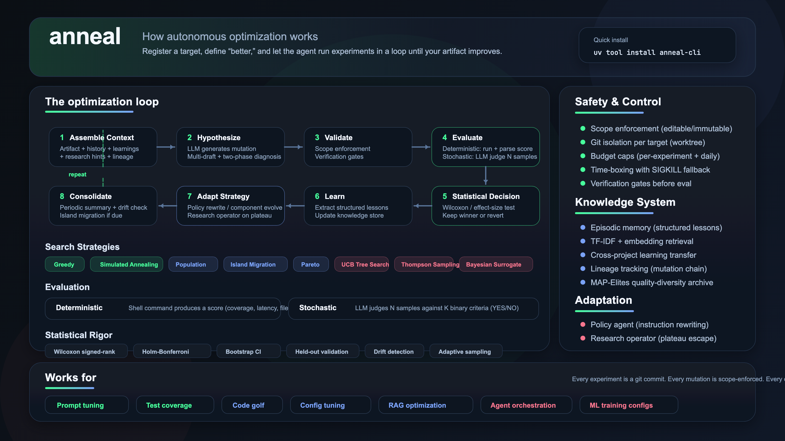
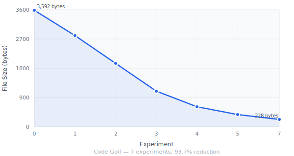

# anneal

[](https://github.com/Mathews-Tom/anneal/actions/workflows/ci.yml)
[](https://pypi.org/project/anneal-cli/)
[](https://pypi.org/project/anneal-cli/)
[](LICENSE)

Let an AI agent improve your code, prompts, and configs — overnight, unattended.

<picture>
  
</picture>

<video src="https://github.com/user-attachments/assets/06f8848d-a404-4b58-817a-8c0bf8bb71e3" width="100%" autoplay loop muted playsinline></video>

Point anneal at any text file in a git repo, tell it how to measure "better," and walk away. The agent generates hypotheses, runs experiments, keeps winners, discards losers, and compounds learnings — all while you sleep.

## Quick Start

```bash
uv tool install anneal-cli
```

Requires Python 3.12+.

```bash
# Register a target
anneal register \
  --name my-target \
  --artifact path/to/file.py \
  --eval-mode deterministic \
  --run-cmd "python benchmark.py" \
  --parse-cmd "grep 'score' | awk '{print \$2}'" \
  --direction maximize \
  --scope scope.yaml

# Run experiments
anneal run --target my-target --experiments 20

# Review results — every experiment is a git commit
git log --oneline
```

## Supported Providers

| Provider              | Models      | Notes                          |
| --------------------- | ----------- | ------------------------------ |
| Anthropic             | claude-\*   | Default. Claude Code or API    |
| OpenAI                | gpt-\*      | Via OpenAI SDK                 |
| Google                | gemini-\*   | Via OpenAI-compatible endpoint |
| Ollama                | ollama/\*   | Local. $0 cost tracking        |
| LM Studio             | lmstudio/\* | Local. $0 cost tracking        |
| Any OpenAI-compatible | Custom      | Via base URL override          |

## Two Evaluation Modes

<details>
<summary>Deterministic — shell command produces a number</summary>

A shell command produces a numeric score. Run code, parse output, compare. Use for: performance benchmarks, test coverage, file size, build time.

```bash
--eval-mode deterministic \
--run-cmd "pytest --cov=src --cov-report=term | grep TOTAL | awk '{print \$4}'" \
--parse-cmd "cat"
```

</details>

<details>
<summary>Stochastic — LLM judges N samples against K binary criteria</summary>

An LLM judges N samples against K binary (YES/NO) criteria. Use for: prompt quality, documentation clarity, content optimization — anything where output varies between runs.

```bash
--eval-mode stochastic \
--criteria eval_criteria.toml
```

Each criterion is a YES/NO question. Scores aggregate across samples and criteria into a single float.

</details>

## Where Anneal Works

| Use Case                      | Eval Mode     | ~Cost / 50 exp |
| ----------------------------- | ------------- | -------------- |
| Prompt optimization           | stochastic    | $8–$13         |
| API response time             | deterministic | $2–$5          |
| Test coverage improvement     | deterministic | $2–$5          |
| Training config (hyperparams) | deterministic | $2–$8          |
| RAG retrieval prompt          | deterministic | $2–$5          |
| System prompt                 | stochastic    | $8–$15         |
| Config tuning (build/infra)   | deterministic | $1–$3          |

## Where Anneal Does Not Work

| Target                       | Reason                                      |
| ---------------------------- | ------------------------------------------- |
| Binary files, databases      | Artifact must be a text file in git         |
| Embedding model selection    | Requires full re-index — not a file edit    |
| Inter-agent protocol changes | Coordinated multi-file edits required       |
| Live system tuning           | No git isolation, unsafe to mutate in place |
| Cross-service optimization   | Single-artifact scope only                  |
| Database schema migrations   | Irreversible side effects                   |

## Results

### Code Golf — 93.7% size reduction

Shrink a verbose Python file while preserving byte-identical output.

| Metric      | Value                              |
| ----------- | ---------------------------------- |
| Target      | `examples/code-golf/app.py`        |
| Eval mode   | Deterministic (file size in bytes) |
| Direction   | Minimize                           |
| Experiments | 7                                  |
| Start score | 3,592 bytes                        |
| End score   | 228 bytes                          |
| Reduction   | 93.7%                              |

<picture>
  
</picture>

### Prompt Optimization — stochastic eval

Improve an article summarizer prompt against 4 binary criteria across 5 test articles. Scores improve across 10 experiments as the agent iteratively refines the system prompt.

## Examples

### [Prompt Optimization](examples/prompt-optimizer/) — stochastic eval

The agent rewrites `system_prompt.md`, generates summaries from 5 test articles, and an LLM judge scores each against 4 binary criteria (key points captured? concise? plain language? factually accurate?).

```bash
anneal register \
  --name prompt-optimizer \
  --artifact examples/prompt-optimizer/system_prompt.md \
  --eval-mode stochastic \
  --criteria examples/prompt-optimizer/eval_criteria.toml \
  --direction maximize \
  --scope examples/prompt-optimizer/scope.yaml

anneal run --target prompt-optimizer --experiments 10
```

### [Test Coverage](examples/test-coverage/) — deterministic eval, maximize

The agent adds tests to cover untested code paths. `pytest --cov` provides the score. Source code is immutable — the agent can only write tests.

```bash
anneal register \
  --name test-coverage \
  --artifact examples/test-coverage/tests/test_calculator.py \
  --eval-mode deterministic \
  --run-cmd "bash examples/test-coverage/eval.sh" \
  --parse-cmd "cat" \
  --direction maximize \
  --scope examples/test-coverage/scope.yaml

anneal run --target test-coverage --experiments 10
```

### [Code Golf](examples/code-golf/) — deterministic eval, minimize

```bash
anneal register \
  --name code-golf \
  --artifact examples/code-golf/app.py \
  --eval-mode deterministic \
  --run-cmd "bash examples/code-golf/eval.sh" \
  --parse-cmd "cat" \
  --direction minimize \
  --scope examples/code-golf/scope.yaml

anneal run --target code-golf --experiments 10
```

### Local Artifacts (no git tracking required)

Artifact files don't need to be committed to git. If they're untracked, anneal copies them into the worktree automatically during registration. For files you don't want in version control at all, use `--in-place` to skip worktree isolation entirely:

```bash
anneal register \
  --name local-skill \
  --artifact SKILL.md \
  --eval-mode stochastic \
  --criteria eval_criteria.toml \
  --direction maximize \
  --scope scope.yaml \
  --in-place
```

## Documentation

| Doc                                      | What's in it                                             |
| ---------------------------------------- | -------------------------------------------------------- |
| [Overview](docs/overview.md)             | Motivation, lineage, and the core idea                   |
| [Eval Guide](docs/eval-guide.md)         | Writing good binary evaluation criteria                  |
| [Recipes](docs/recipes.md)               | Copy-paste registration commands for common targets      |
| [Use Cases](docs/use-cases.md)           | Where anneal works, where it doesn't, and why            |
| [Features](docs/features.md)             | Search strategies, statistical methods, knowledge system |
| [Architecture](docs/architecture.md)     | Module map and design principles                         |
| [System Design](docs/system-design.md)   | Full technical design document                           |
| [CI Integration](docs/ci-integration.md) | GitHub Actions workflow and status JSON output           |

## Testing

```bash
uv run pytest tests/ -x -q          # 820 tests
uv run pytest tests/ --cov=anneal    # With coverage
```

## License

Apache-2.0
