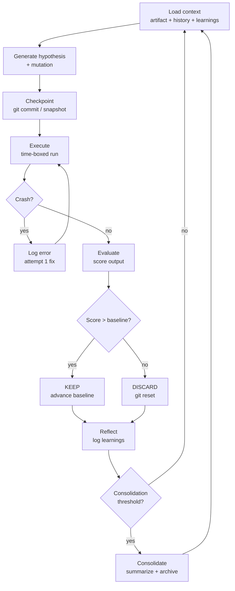
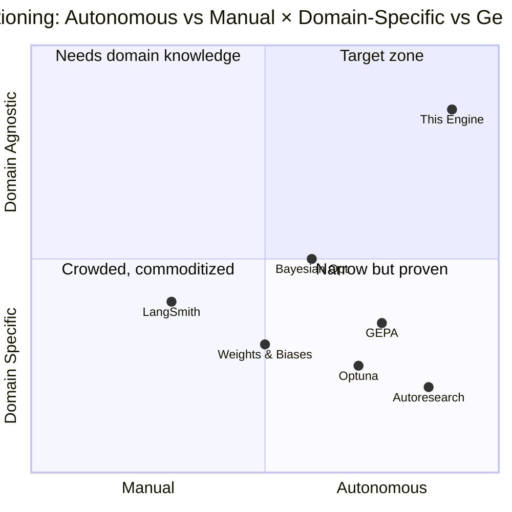

# Anneal — System Overview

## What

A domain-agnostic autonomous optimization framework. Given any measurable artifact — code, prompts, configs, content, copy — the engine runs continuous experiments: mutate, evaluate, keep or discard, learn, repeat. You define three things:

```
(Artifact, Eval, Agent)
```

The engine does the rest. Overnight. Unattended. Indefinitely.

This is not hyperparameter tuning. It's not CI/CD. It's an autonomous research loop that uses LLM agents to generate _informed_ hypotheses (not random search), execute experiments against objective metrics, and compound learnings across hundreds of iterations.

## Lineage

The core loop was proven by three independent sources:

**Karpathy's `autoresearch`** (March 2026) — 630 lines of Python. Agent modifies a training script, trains for 5 minutes, evaluates val_bpb, keeps or reverts via git. 126 experiments overnight → val_bpb dropped from 0.9979 to 0.9697. A 2-day depth-12 run (~700 experiments) yielded ~20 additive improvements, cutting Time-to-GPT-2 from 2.02h → 1.80h (11%). The agent caught a QKNorm scaling bug Karpathy had missed over two decades. 32.6k GitHub stars in 9 days. MIT licensed.

**Nick Saraev's applied demonstrations** — proved the pattern generalizes beyond ML: cold email copy optimization via Instantly API (reply rate as metric), Claude Code SKILL.md prompt improvement via binary eval criteria (32/40 → 39/40), website performance via Lighthouse (1100ms → 67ms load time). The stochastic eval framework (N samples × K binary criteria) emerged from this work.

**Greg Isenberg / Tobi Lütke** — mapped the pattern to 10+ commercial verticals. Lütke pointed the loop at Shopify's QMD query-expansion model: 0.8B parameter model outperformed his previous 1.6B after 37 experiments in 8 hours (19% improvement). Isenberg coined the "optimize button" SaaS concept — embed the loop inside existing products as a user-facing feature.

### What This Engine Adds Over Autoresearch

Autoresearch is a proof-of-concept for one domain (ML training, single GPU, single file, single metric). This engine is a production system for every domain. The differences are structural:

| Dimension         | Autoresearch                      | This Engine                                                                               |
| ----------------- | --------------------------------- | ----------------------------------------------------------------------------------------- |
| Scope             | ML training only                  | Any domain with a measurable artifact                                                     |
| Artifact          | One file (`train.py`)             | Code, prompts, configs, content — multi-file                                              |
| Eval              | Single deterministic metric       | Two modes: deterministic (scalar) + stochastic (N×K binary criteria)                      |
| Metric source     | Local grep from log               | Local computation, external APIs, real-world feedback                                     |
| Hardware          | NVIDIA GPU required               | Runs anywhere — no GPU needed                                                             |
| Knowledge         | Flat TSV, no cross-session memory | Structured DAG with semantic retrieval, consolidation, and cross-experiment learning pool |
| Safety            | git reset                         | Budget caps, failure limits, regression guards, immutable eval boundary                   |
| Verification      | None                              | Binary pass/fail gates before eval, per-draft pruning in multi-draft                      |
| Failure diagnosis | None                              | Structured taxonomy with LLM classification, blind spot detection                         |
| Search            | Linear (always HEAD)              | Greedy, SA, Population, Pareto, UCB tree search with backtracking                         |
| Meta-optimization | None                              | Two-timescale: policy agent (continuous) + plateau rewriting (episodic)                   |
| Multi-draft       | Single mutation per cycle         | N drafts with verifier pruning, temperature variation                                     |

Six key innovations: stochastic eval framework, multi-target orchestration, knowledge compounding with consolidation, cross-experiment learning pool (cross-condition, cross-target, cross-project), external feedback loop integration, and embeddability (as SaaS feature, CI stage, or always-on service).

## Why This Matters

### The Problem

Improvement is manual, slow, and episodic. A developer tunes hyperparameters one at a time during work hours. A marketer A/B tests email copy by manually creating variants and waiting days. A prompt engineer iterates on SKILL.md files through trial and error with no systematic feedback loop.

The bottleneck is never hypothesis generation or execution — it's the human in the loop. Humans eat, sleep, context-switch, and run a handful of experiments per day.

### The Opportunity

LLM agents eliminate the bottleneck. They generate informed hypotheses 24/7 (drawing on domain knowledge from training), execute experiments via APIs and CLIs, parse results programmatically, and decide keep/discard without emotional attachment. This is not random search — the LLM brings domain knowledge to mutation generation, making the search dramatically more sample-efficient than grid search or Bayesian optimization for many problem types.

### The Compound Advantage

Each experiment produces a learning record: what was tried, why, what happened, whether it was kept. This log becomes a knowledge base that future agents read before generating new hypotheses. After 100 experiments, the agent has a rich corpus of domain-specific learnings. This knowledge transfers across model generations — when Opus 5.0 arrives, hand it the accumulated research log from its predecessors.

### Cross-Experiment Learning

Knowledge compounds not just within a single experimental track, but _across_ them. The Learning Pool architecture enables three levels of cross-pollination:

**Cross-condition** — when multiple search strategies run in parallel (e.g., guided mutation, random search, Bayesian optimization), discoveries from one strategy feed into others. A random mutation that accidentally improves a metric contains a real signal — the guided agent, with its ability to reason about _why_ that worked, can exploit the discovery intentionally.

**Cross-target** — a prompt optimization target discovers "shorter sentences improve legibility." A code optimization target in the same repo applies that pattern to comments and docstrings. Learnings transfer across domains within a project through a shared Learning Pool with scope-based filtering.

**Cross-project** — meta-patterns like "smaller diffs are more likely to be kept" or "agents plateau at ~80% of theoretical max" transfer across all domains. A global knowledge base accumulates these domain-agnostic observations over time, giving new optimization targets a head start.

Each Learning is a distilled observation — not a raw experiment record — with mandatory source attribution (which condition, target, and project produced it). The consuming agent always knows whether it's reading its own history or cross-pollinated insights.

### Why Not CI/CD?

CI optimizes for pass/fail (does this change break anything?). This engine optimizes for _better_ (does this change improve the metric?). CI is defensive; autonomous experimentation is offensive. A anneal needs both: CI gates prevent regression while the experiment loop drives toward optimality.

## How It Works

### The Experiment Loop



### Two Eval Modes

**Deterministic** — single execution produces a single number. Run code → read metric → compare. Used for: ML training (val_bpb), website performance (Lighthouse), API latency (p99), test coverage (%).

**Stochastic** — outputs vary per run (LLM-generated content, creative artifacts). Generate N samples → score each against K binary criteria → aggregate to single score. Used for: prompt/skill optimization, email copy, chatbot scripts, ad creatives.

The N×K binary criteria matrix is the key innovation that enables prompt and content optimization — domains where autoresearch's deterministic eval doesn't apply.

### Domain Selection Criteria

Not every domain is equally suited. The ideal target has:

1. **Fast feedback** — 2-minute loops run 720 experiments/day. 24-hour loops run 1.
2. **Clear metric** — objective, measurable, unambiguous. "Reply rate" works. "Brand warmth" doesn't.
3. **API access to inputs** — the agent must change the artifact programmatically.
4. **Low cost per experiment** — $0.20/experiment allows free exploration. $100/experiment requires high conviction.
5. **Tolerance for experimentation** — production systems need staging or shadow environments.

## Market Research

### Competitive Landscape



| Competitor                  | What It Does                     | Key Limitation                                                                            |
| --------------------------- | -------------------------------- | ----------------------------------------------------------------------------------------- |
| **Autoresearch**            | Autonomous ML experiment loop    | ML-only, single metric, no memory, NVIDIA GPU required                                    |
| **Optuna / Ray Tune**       | Hyperparameter optimization      | ML-only, no natural language hypothesis generation, no knowledge compounding              |
| **GEPA** (ICLR 2026)        | Genetic-Pareto prompt evolution  | Prompt-only, works on frozen models (no weight optimization), no general artifact support |
| **Weights & Biases**        | Experiment tracking + sweeps     | Tracking tool, not autonomous. Human still designs and runs experiments                   |
| **LangSmith / Braintrust**  | LLM eval frameworks              | Evaluation infrastructure, not optimization. Score but don't improve                      |
| **DSPy**                    | Programmatic prompt optimization | Prompt-specific, framework-locked, no general artifact support                            |
| **LaunchDarkly / Split.io** | Feature flagging + A/B testing   | Manual experiment design, no autonomous mutation generation                               |

### Positioning

No existing tool occupies the intersection of _domain-agnostic_ and _fully autonomous_. Optuna and autoresearch are autonomous but domain-locked to ML. LangSmith and W&B are domain-agnostic for tracking but manual for experimentation. This engine is the first to generalize the autonomous experiment loop to arbitrary measurable artifacts with accumulated knowledge.

### Addressable Markets

| Segment                   | Who                                          | Pain Point                                        | Engine Application                                                    |
| ------------------------- | -------------------------------------------- | ------------------------------------------------- | --------------------------------------------------------------------- |
| **AI/ML engineers**       | Prompt engineers, fine-tuning teams          | Manual prompt iteration, no systematic feedback   | Stochastic eval on SKILL.md, system prompts, tool configs             |
| **Growth teams**          | Marketers, CRO specialists                   | Slow A/B testing cycles (weeks per test)          | Cold email copy, landing pages, ad creatives — overnight optimization |
| **SaaS platforms**        | Product teams building optimization features | No embeddable optimization loop exists            | "Optimize button" — white-label the engine as a product feature       |
| **DevOps / SRE**          | Performance engineers                        | Manual performance tuning                         | Lighthouse, bundle size, latency — deterministic eval on code         |
| **Consulting / agencies** | Firms selling optimization services          | Billing hourly for work an agent can do overnight | Research-as-a-service with 100× experiment throughput                 |

### TAM Framing

The engine doesn't create a new market — it automates existing human labor across multiple markets. Conservative framing: if a prompt engineer spends 40% of their time on iterative optimization that this engine replaces, and there are ~500k people in AI/ML roles globally doing this work, the labor displacement alone represents meaningful value before considering marketing, DevOps, and SaaS embedding.

The more interesting frame: **the engine enables experiments that wouldn't happen at all.** No marketer runs 100 A/B tests overnight because it's humanly impossible. The engine doesn't replace the 30 experiments/year — it enables the 36,500/year that were never feasible.

## Application Domains

### Software & Developer Tools

| Domain                    | Artifact                 | Metric                  | Loop Speed |
| ------------------------- | ------------------------ | ----------------------- | ---------- |
| Prompt/skill optimization | SKILL.md, system prompts | Binary eval pass rate   | 2-5 min    |
| Website performance       | Source code              | Lighthouse score        | 5-10 min   |
| Test coverage             | Test files               | Coverage %              | 1-5 min    |
| API latency               | Server code              | p99 latency             | 5-10 min   |
| Build optimization        | Bundler configs          | Build time, bundle size | 2-10 min   |

### Sales & Marketing

| Domain               | Artifact         | Metric               | Loop Speed |
| -------------------- | ---------------- | -------------------- | ---------- |
| Cold email copy      | Email templates  | Reply rate           | 4-24 hours |
| Landing pages        | Page HTML/copy   | Conversion rate      | 1-7 days   |
| Ad creatives         | Templates + copy | CTR, CVR, ROAS       | 4-24 hours |
| Product descriptions | Listing copy     | Sales, click-through | 1-7 days   |

### Business Operations

| Domain             | Artifact                 | Metric                | Loop Speed |
| ------------------ | ------------------------ | --------------------- | ---------- |
| Chatbot scripts    | System prompt, templates | CSAT, resolution rate | Hours-days |
| Lead qualification | Scoring rules            | Conversion per lead   | Days       |
| Support routing    | Routing rules, templates | Resolution time       | Hours      |

### Finance (Human-in-Loop Required)

| Domain                 | Artifact         | Metric              | Loop Speed    |
| ---------------------- | ---------------- | ------------------- | ------------- |
| Trading backtesting    | Strategy rules   | Sharpe ratio        | Minutes (sim) |
| Risk model calibration | Model parameters | Prediction accuracy | Minutes       |

## Worked Examples

### Example 1: Claude Code Skill Optimization (Stochastic)

**Target**: SKILL.md for diagram generation.
**Eval**: 10 samples × 4 binary criteria = max score 40. Evaluator: Sonnet (vision-capable).

Criteria: (1) text legibility, (2) pastel colors only, (3) linear layout, (4) no ordinals.

**Cost**: ~$0.20/experiment. 50 experiments to convergence ≈ $10.
**Progression**: 32/40 → 37/40 (color constraint) → 39/40 (simplified icons) → plateau at 39/40.

### Example 2: Cold Email Copy (Deterministic, External API)

**Target**: Email template. **Metric**: Reply rate via Instantly API.
**Loop**: 4 hours (delivery + reply window). Min 200 emails before scoring.
**Progression**: 1.5% → 2.1% (experiment 4) → 2.7% (experiment 12) → 3.4% (experiment 30).

### Example 3: Website Performance (Deterministic, Multi-Metric)

**Target**: App source code (multi-file). **Metric**: Lighthouse performance × 0.6 + accessibility × 0.3 + bundle size × 0.1.
**Progression**: 45 → 62 (code splitting) → 71 (image optimization) → 84 (lazy loading) → 93 (fine-tuning).

### Example 4: Meta — Optimizing the Optimizer

**Target**: `program.md` itself. **Metric**: Average score improvement per experiment across all targets.
Recursive self-improvement loop. Constraint: meta-optimization depth capped at 1 (optimize the optimizer, not the optimizer's optimizer).

## Risks and Mitigations

### Risk 1: Goodhart's Law (Metric Gaming) — PRIMARY RISK

The agent will find ways to improve the metric that don't improve the system. Test coverage goes up via `assert True`. Lighthouse scores improve by removing features. Prompts parrot eval criteria keywords.

**Why autoresearch sidesteps this**: val_bpb is computed on a held-out set with an immutable eval function. The agent cannot touch eval code, eval data, or the metric definition.

**This engine must preserve the same property.** The `immutable` section of scope.yaml is the architectural decision that separates a useful engine from a metric-gaming machine.

Mitigations: immutable eval boundary (primary), holistic "would an expert approve?" criterion, binary criteria (less gaming surface), periodic human review, separate evaluator model, eval criteria rotation.

### Risk 2: Evaluator Drift

The LLM evaluator is stochastic — scoring may drift across runs, creating phantom improvements. Mitigations: pin evaluator model version, run eval multiple times (take mode, not mean), minimum improvement threshold (≥2 points to keep).

### Risk 3: Runaway Costs

Stochastic evals at 10 samples every 2 minutes compound fast. External APIs have rate limits and per-call costs. Mitigations: explicit budget caps per target (max $/day), cost tracking in experiment log, cheaper models for generation (Haiku for samples, Sonnet for eval), reduced sample count as score converges.

### Risk 4: Local Optima

Agent finds a local peak and can't escape — incremental mutations don't help but a structural change would. Mitigations: periodic "wild" mutations, "reset to different baseline" option on plateau detection, score velocity tracking (no improvement in M experiments → exploration mode).

### Risk 5: Catastrophic Mutation

A mutation breaks the artifact or corrupts git history. Mitigations: git checkpoint before every mutation (always recoverable), sanity checks before scoring (syntax, type checking, test suite), strict scope enforcement.

### Risk 6: Knowledge Store Bloat

After hundreds of experiments, the knowledge store exceeds the agent's context window. Mitigations: consolidation every 50 experiments (summarize + archive raw entries), semantic retrieval over historical experiments (not full load), only last N consolidated summaries in active context.

### Risk 7: Adversarial Content Optimization

For content-facing targets (emails, landing pages), the agent may produce manipulative or deceptive content that optimizes clicks at the expense of truthfulness. Mitigations: ethical constraints in program.md, eval criteria for truthfulness, human review before content reaches end users.

### Risk 8: Feedback Loop Latency Mismatch

Real-world metrics (reply rate, conversion) take hours or days. Agent draws conclusions from insufficient data. Mitigations: minimum sample sizes before scoring (200 emails), statistical significance tests (chi-squared, Fisher's exact), loop intervals matched to metric cadence.

### Risk 9: Recursive Self-Improvement Divergence

Meta-optimization (optimizing the optimizer's instructions) can compound small eval errors into misaligned behavior. Mitigations: human review of program.md changes, cap meta-optimization depth at 1, simple conservative meta-eval (optimization velocity only).

## References

- [karpathy/autoresearch](https://github.com/karpathy/autoresearch) — original autonomous ML experiment loop
- [Stop Fixing Your Claude Skills. Autoresearch Does It For You](https://www.youtube.com/watch?v=qKU-e0x2EmE) — Nick Saraev. Stochastic eval with binary criteria for skills
- [Claude Code + Karpathy's Autoresearch = The New Meta](https://youtu.be/4Cb_l2LJAW8) — Nick Saraev. Generalization to cold email, landing pages
- [Karpathy's "autoresearch" broke the internet](https://www.youtube.com/watch?v=qb90PPbAWz4) — Greg Isenberg. 10 commercial verticals, "optimize button" concept
